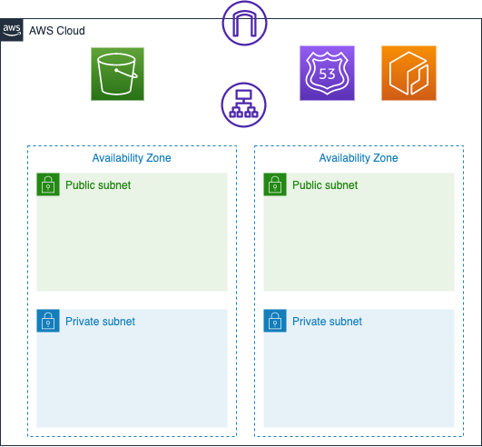

# aws_staging_demo
This repository is a demo for AWS *Staging* environment.
Supposed some situation like
- Need AWS Fargate *Staging* environment
- Each developer needs a unique *Staging* environment
- And each developer can deploy to their own *Staging* environment at their own timing

I solved this problem by using `Terraform`, `Terragrunt` and CI/CD.
Each *Staging* environment shares some resources.(VPC etc.)

# Usage
I assume `Terraform`, `Terragrunt` is already installed, and created IAM user for it.
Fist of all, create [backend](https://developer.hashicorp.com/terraform/language/settings/backends/s3).
```zsh
% BUCKET_NAME=hoge_bucket
% aws s3 mb $BUCKET_NAME
```

Next, copy `terraform/env.yaml.example` to `terraform/env.yaml`.Then, set your bucket name and your application domain name.

It's time to deploy Terraform resources🚀.


## Common resources
Common resources mean literally common resources for all users, such as VPC, Subnet, Security Group, etc.

1. move common resources Terraform directory
```zsh
% cd terraform/common_resources
```

1. apply
```zsh
% terragrunt apply
```

This deploy creates just a *plain box* like under architecture.



Next, we put some application in this box.

## User resources

User resources create resources for each user.
There two way of deploying this resources.
One is deploy by human, and the other is deploy by CI/CD.
This section describes how to deploy by human.

1. move user resources Terraform directory
```zsh
% cd terraform/user_resources
```

2. apply
```zsh
% terragrunt apply
```

It's all done!

# CI/CD
GitHub Actions is used for CI/CD.
The staging deploy workflow triggered by [workflow_dispatch](https://docs.github.com/en/actions/managing-workflow-runs/manually-running-a-workflow).
First time, Terraform create below resources.
- ECS
  - Cluster
  - Task Definition
  - Service
- ALB
  - listener
  - target group
- Route53
  - A record

Then `http://<your github username>.<your domain>` id registered to Route53.
After that, update Task Definition, and restart Fargate.
And ALB Lister handle request to your own Fargate depend on host header (`<your github username>.`) .


# Note
- This repository is just a demo, so it doesn't have any test.
- SSL certificate is not included in this repository.
- This repository doesn't have any resources for like `production` environment. (common_resources has `production` , but it's just a dummy.)